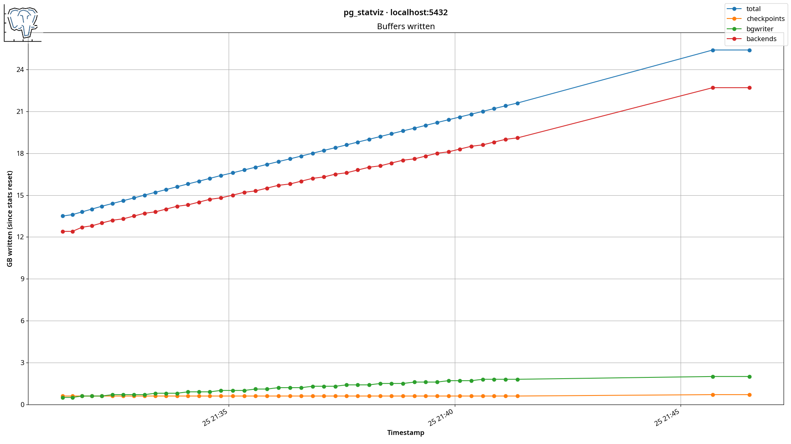
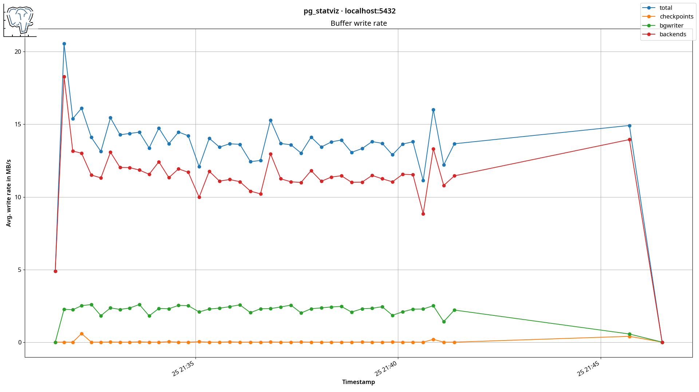

# pg_statviz

`pg_statviz` is a minimalist extension and utility pair for time series analysis and visualization
of PostgreSQL internal statistics.

Created for capturing PostgreSQL's cumulative and dynamic statistics, `pg_statviz` enables deeper
time series analysis than the standard PostgreSQL statistics views. The included utility generates
visualizations for selected time ranges from the stored statistic snapshots, helping users track
PostgreSQL performance over time and potentially aiding in performance tuning and troubleshooting.

## Design Philosophy

Designed with the [K.I.S.S.](https://en.wikipedia.org/wiki/KISS_principle) and
[UNIX](https://en.wikipedia.org/wiki/Unix_philosophy) philosophies in mind, `pg_statviz` aims to be
a modular, minimal and unobtrusive tool that does only what it's meant for: create snapshots
of PostgreSQL statistics for visualization and analysis. To this end, a utility is provided for
retrieving and creating simple visualizations with the stored snapshots, by using
[pandas](https://pandas.pydata.org/) and [Matplotlib](https://github.com/matplotlib/matplotlib).

## Installing the extension

### Debian (12+) / Ubuntu (22.04+)

1. Configure the PostgreSQL Deb repository for your Linux distribution, as
[explained here for Debian](https://www.postgresql.org/download/linux/debian/) and
[here for Ubuntu](https://www.postgresql.org/download/linux/ubuntu/).
2. Use `apt` to install the extension for your PostgreSQL version:

        sudo apt install postgresql-<pg_version>-statviz        

### Red Hat Enterprise Linux (v8.0+) / Fedora (37+)

1. Configure the PostgreSQL Yum repository for your Linux distribution, as
[explained here](https://www.postgresql.org/download/linux/redhat).
2. Use `dnf` or `yum` to install the extension for your PostgreSQL version:

        sudo dnf install pg_statviz_extension-<pg_version>
        OR
        sudo yum install pg_statviz_extension-<pg_version>

### PGXN (PostgreSQL Extension Network)

The extension is available on [PGXN](https://pgxn.org/dist/pg_statviz/).

To install from PGXN, either download the zip file and install manually or use the
[PGXN Client](https://pgxn.github.io/pgxnclient/) to install:

    pgxn install pg_statviz

### Manual installation

To install manually, clone this repository locally:

    git clone https://github.com/vyruss/pg_statviz.git

This will install the extension in the appropriate location for your system (`$SHAREDIR/extension`):

    cd pg_statviz
    sudo make install

### Enabling the extension

The extension can now be enabled inside the appropriate database like this, e.g. from `psql`:

    \c mydatabase
    CREATE EXTENSION pg_statviz;

This will create the needed tables and functions under schema `pgstatviz` (note the lack of
underscore in the schema name).

## Installing the utility

The visualization utility can be installed from [PyPi](https://pypi.org/project/pg_statviz/):

    pip install pg_statviz

The utility is also available in the [Debian](https://www.postgresql.org/download/linux/debian/) and
[Ubuntu](https://www.postgresql.org/download/linux/ubuntu/) PostgreSQL Deb Repositories, and can be installed
using `apt`:

    sudo apt install pg-statviz

Finally, it can be found in the
[PostgreSQL Yum Repository](https://www.postgresql.org/download/linux/redhat/) and can be installed
using `dnf` or `yum`:

    sudo dnf install pg_statviz
    OR
    sudo yum install pg_statviz

### Requirements

Python 3.9+ is required for the visualization utility.
Any recent PostgreSQL version up to and including 17 is supported.

## Usage

The extension can be used by superusers or any user that has `pg_monitor` role privileges. To take
a snapshot, e.g. from `psql`:

    SELECT pgstatviz.snapshot();

[comment]::

    NOTICE:  created pg_statviz snapshot
               snapshot
    -------------------------------

     2024-06-27 11:04:58.055453+00

    (1 row)

Older snapshots and their associated data can be removed using any time expression. For example, to
remove data more than 90 days old:

    DELETE FROM pgstatviz.snapshots
    WHERE snapshot_tstamp < CURRENT_DATE - 90;

Or all snapshots can be removed like this:

    SELECT pgstatviz.delete_snapshots();

[comment]::

    NOTICE:  truncating table "snapshots"
    NOTICE:  truncate cascades to table "buf"
    NOTICE:  truncate cascades to table "conf"
    NOTICE:  truncate cascades to table "conn"
    NOTICE:  truncate cascades to table "lock"
    NOTICE:  truncate cascades to table "io"
    NOTICE:  truncate cascades to table "wait"
    NOTICE:  truncate cascades to table "wal"
    NOTICE:  truncate cascades to table "db"
     delete_snapshots
    ------------------

    (1 row)

The `pg_monitor` role can be assigned to any user:

    GRANT pg_monitor TO myuser;

## Scheduling

Periodic snapshots can be set up with any job scheduler. For example with `cron`:

    crontab -e -u postgres

Inside the `postgres` user's crontab, add this line to take a snapshot every 15 minutes:

    */15 * * * * psql -c -d mydatabase "SELECT pgstatviz.snapshot()" >/dev/null 2>&1

## Visualization

Potentially very large numbers of data points can be visualized with the aid of pandas resampling,
displaying the mean value over 100 plot points as a default.

The visualization utility can be called like a PostgreSQL command line tool:

    pg_statviz --help

[comment]::

    usage: pg_statviz [--help] [--version] [--dbname DBNAME] [-h HOSTNAME] [--port PORT]
                      [-u USERNAME] [--password] [--daterange FROM TO] [-o OUTPUTDIR]
                      {analyze,buf,cache,checkp,conn, io,lock,tuple,wait,wal,xact} ...

    run all analysis modules

    positional arguments:
      {analyze,buf,cache,checkp,conn,io,lock,tuple,wait,wal,xact}
        analyze             run all analysis modules
        buf                 run buffers written analysis module
        cache               run cache hit ratio analysis module
        checkp              run checkpoint analysis module
        conn                run connection count analysis module
        io                  run I/O analysis module
        lock                run locks analysis module
        tuple               run tuple count analysis module
        wait                run wait events analysis module
        wal                 run WAL generation analysis module
        xact                run transaction count analysis module

    options:
      --help
      --version             show program's version number and exit
      -d DBNAME, --dbname DBNAME
                            database name to analyze (default: 'myuser')
      -h HOSTNAME, --host HOSTNAME
                            database server host or socket directory (default: '/var/run/postgresql')
      -p PORT, --port PORT  database server port (default: '5432')
      -U USERNAME, --username USERNAME
                            database user name (default: 'myuser')
      -W, --password        force password prompt (should happen automatically) (default: False)
      -D FROM TO, --daterange FROM TO
                            date range to be analyzed in ISO 8601 format e.g. 2024-01-01T00:00
                            2024-01-01T23:59 (default: [])
      -O OUTPUTDIR, --outputdir OUTPUTDIR
                            output directory (default: -)

### Specific module usage

    pg_statviz conn --help

[comment]::

    usage: pg_statviz conn [-h] [-d DBNAME] [--host HOSTNAME] [-p PORT] [-U USERNAME] [-W]
                           [-D FROM TO] [-O OUTPUTDIR] [-u [USERS ...]]

    run connection count analysis module

    options:
      -h, --help            show this help message and exit
      -d DBNAME, --dbname DBNAME
                            database name to analyze (default: 'myuser')
      --host HOSTNAME       database server host or socket directory (default: '/var/run/postgresql')
      -p PORT, --port PORT  database server port (default: '5432')
      -U USERNAME, --username USERNAME
                            database user name (default: 'myuser')
      -W, --password        force password prompt (should happen automatically) (default: False)
      -D FROM TO, --daterange FROM TO
                            date range to be analyzed in ISO 8601 format e.g. 2024-01-01T00:00
                            2024-01-01T23:59 (default: [])
      -O OUTPUTDIR, --outputdir OUTPUTDIR
                            output directory (default: -)
      -u [USERS ...], --users [USERS ...]
                            user name(s) to plot in analysis (default: [])

### Example:

    pg_statviz buf --host localhost -d postgres -U postgres -D 2024-06-24T23:00 2024-06-26

### Produces:

[comment]::

## Schema

The `pg_statviz` extension stores its data in the following tables:

Table | Description
--- | ---
`pgstatviz.snapshots` | Timestamped snapshots
`pgstatviz.buf` | Buffer, checkpointer and background writer data
`pgstatviz.conf` | PostgreSQL server configuration data
`pgstatviz.conn` | Connection data
`pgstatviz.db` | PostgreSQL server and database statistics
`pgstatviz.io` | I/O stats data
`pgstatviz.lock` | Locks data
`pgstatviz.wait` | Wait events data
`pgstatviz.wal` | WAL generation data

## Export data

To dump the captured data, e.g. for analysis on a different machine, run:

    pg_dump -d <dbname> -a -O -t pgstatviz.* > pg_statviz_data.dump

Load it like this on the target database (which should have `pg_statviz` installed) :

    psql -d <other_dbname> -f pg_statviz_data.dump

Alternatively, `pg_statviz` internal tables can also be exported to a tab separated values (TSV) file
for use by other tools:

    psql -d <dbname> -c "COPY pgstatviz.conn TO STDOUT CSV HEADER DELIMITER E'\t'" > conn.tsv

These can then be loaded into another database like this, provided the tables exist (installing the extension will create them):

    psql -d <other_dbname> -c "COPY pgstatviz.conn FROM STDIN CSV HEADER DELIMITER E'\t'" < conn.tsv

